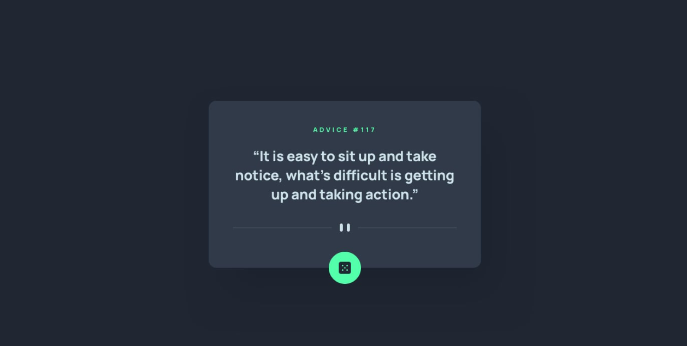
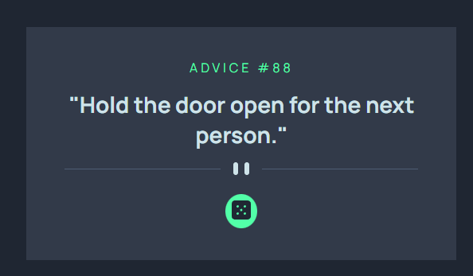
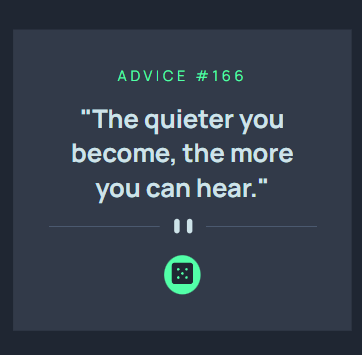

<h1 align="center"> Frontend Mentor - Solução de Advice Generator</h1>

Essa é uma solução para o [Desafio Advice Generator](https://www.frontendmentor.io/challenges/advice-generator-app-QdUG-13db). Os desafios do Frontend Mentor ajudam você a aprimorar suas habilidades de programação por meio da criação de projetos realistas.

    

## 💻 Projeto

Este projeto é um gerador de conselhos, onde ao clicar no botão, um novo conselho aleatório é gerado.

## Acesse o Advice Generator [clicando aqui](https://antoniorafaeldev.github.io/todo-app/)

## 🚀 Tecnologias

Esse projeto foi desenvolvido com as seguintes tecnologias:

- HTML
- CSS
- JavaScript
- Git e GitHub

### O Que Aprendi

- Neste projeto, aprendi programação assíncrona e a fazer requisições com o fetch API.

## Screenshot do resultado

### Versão Desktop

 
    

### Versão Mobile

 
    

## Autor 

- Website - [Antônio Rafael](https://github.com/antoniorafaeldev)
- Frontend Mentor - [@Antonio-Rafael-Silva](https://www.frontendmentor.io/profile/antoniorafaeldev)
- Linkedin - [Antônio Rafael](https://www.linkedin.com/in/ant%C3%B4nio-rafael-01131b372/)